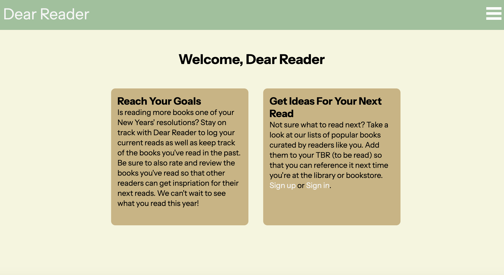

# Dear Reader - Book Tracker 
Dear Reader is a book tracking app that allows users to log the books that they are currently reading, have finished reading, have DNF (did not finish reading) and books that they would like to read. The app is capable of CRUD functionality as it allows users to create book lists, edit or delete them as necessary, and peruse other users' book lists. As an avid reader who utilizes book tracking apps such as Goodreads, this simple CRUD app gave me the chance to personalize my own tracker and to see how some of my favorite features are implemented.

In addition to logging one's reads, users can also leave detailed reviews and ratings. This helps other users to determine whether or not a particular book might be of interst to them. Finally, there is a list of 100 of the top books of the 21st century according to NYT readers. This list contains some of the most popular books of the modern age and is a fantastic starting point for anyone in need of inspiration for their next read.

## Check it out [here][app]: 

[app]: https://dear-reader-77419339e75e.herokuapp.com/

## Attributions
Attributions include Capriola font hosted on Google Fonts. https://fonts.google.com/specimen/Instrument+Sans

## Technologies Used
* Express.js
* Javascript
* CSS

## Future Plans 
In the future, I would like to implement a feature in which users can peruse Dear Reader's recommended books lists (as I would like to offer more than one in the future) and add to their book lists with the click of a button. Another stretch goal that I would like to implement would be the addition of book covers to the app as readers do in fact tend to judge a book by its cover before reading the synopsis.